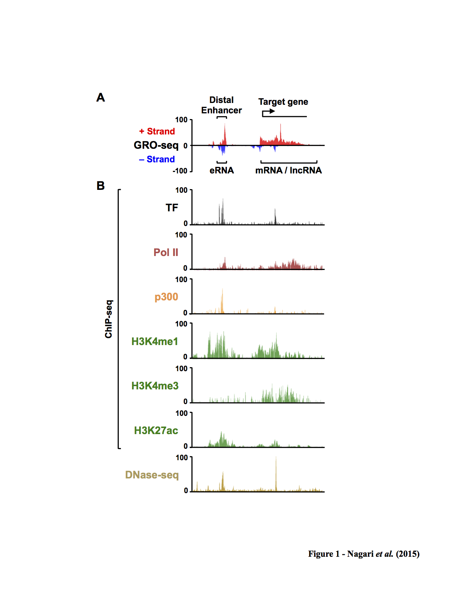
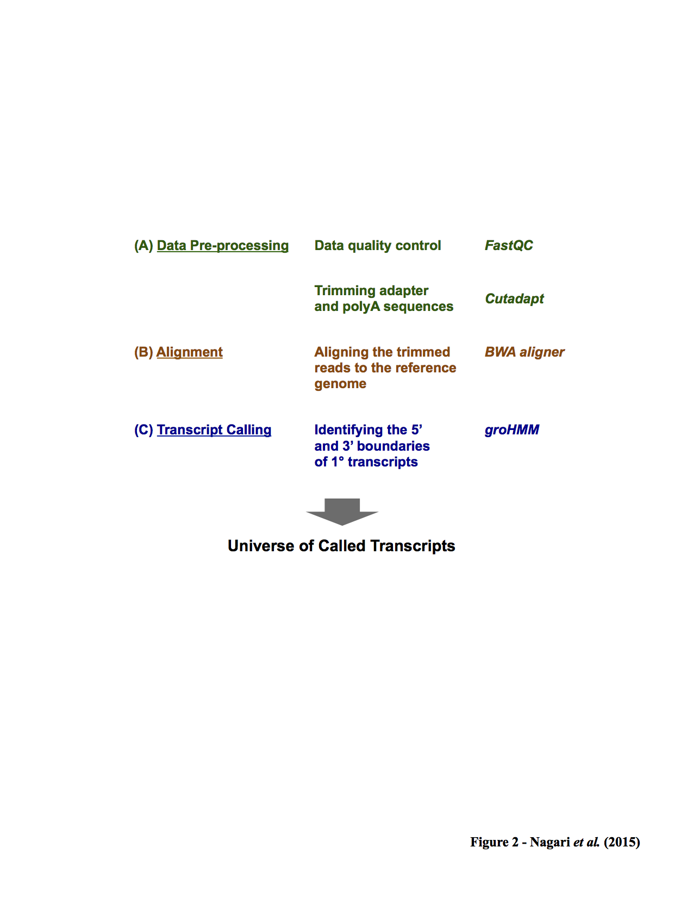
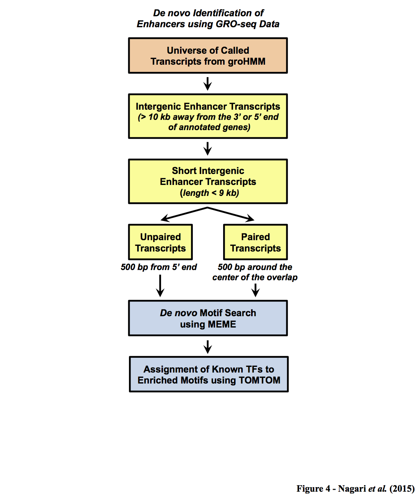
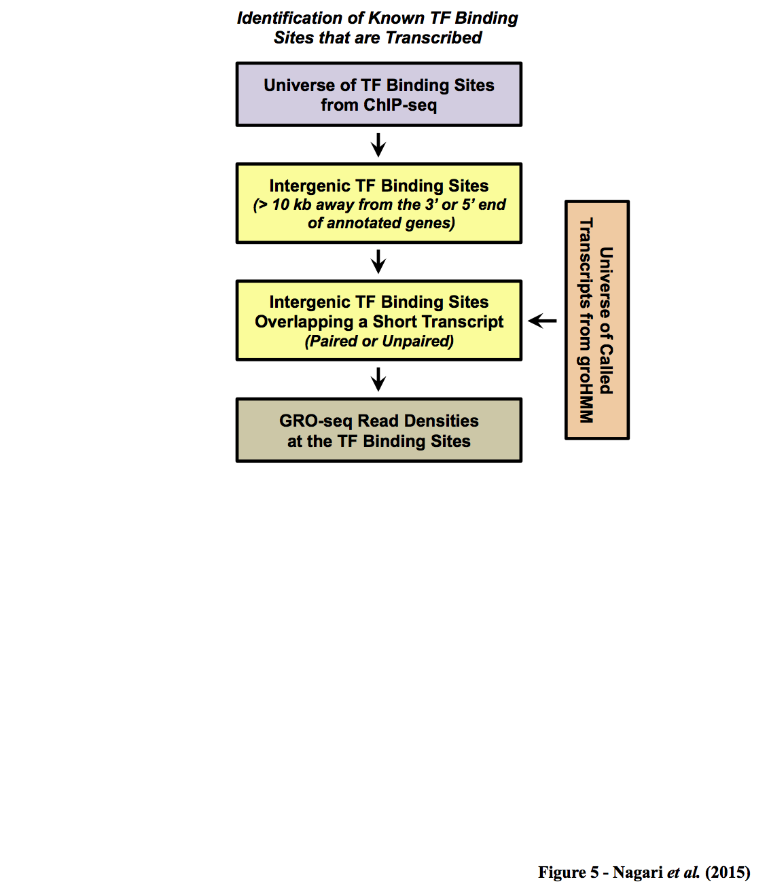

# Kraus lab template for identifying active enhancers from GRO-seq data.

This directory and pipeline contains the scripts to identify active enhancers from GRO-seq data.



## Dependencies:

* [R](www.r-project.org/)
* [Perl](https://www.perl.org)
* [Python](https://www.python.org/)
* [fastqc](http://www.bioinformatics.babraham.ac.uk/projects/fastqc/)
* [cutadapt](http://cutadapt.readthedocs.org/en/stable/index.html)
* [Burrows-Wheeler aligner (BWA)](http://bio-bwa.sourceforge.net)
* [groHMM](http://www.bioconductor.org/packages/release/bioc/html/groHMM.html)
* [bedtools](http://bedtools.readthedocs.org/en/latest/)
* [samtools](http://samtools.sourceforge.net/)


## Steps:

### Processing and aligning (Single Replicate)

- quality-metric-fastqc            - Calculate Quality metrics on fastq file.
- trim-adapter                     - Trims 3' adapter.  If reads are >32bp after trimming, they are kept for alignment.
- trim-polyA                       - Trims polyA (up to 20A's).  If reads are >32bp after trimming, they are kept for alignment.
- align-bwa                        - Aligns data using BWA to assembly.

### Analyzing data using groHMM
(TODO): Add scripts and steps


###<br/><br/><br/><br/>  Identification of active enhancers


#### 1. De novo identification of enhancers

- extend-genic-transcripts         - Extend 10 kb away from either end of annotated genes.
- intergenic-transcripts           - Reports enhancer transcripts that have no overlap +/- 10kb of genic regions.
- Define_enhancer_transcripts.pl   - Defines short paired intergenic transcripts and information about the overlap of the transcript pair.

####<br/><br/><br/><br/><br/><br/> 2. Identification of known Transcription Factors (TF) binding sites that are actively transcribed


## Pipeline/Workflow
*Processing and aligning:*
```
INPUTS:  reads.fastq.gz                 reads.fastq.gz                    trim-adapter.fastq.gz(a)          trim-polyA.fastq.gz(b)
                |                            |                                  |                                 |
                V                            V                                  V                                 V
STEPS:   quality-metric-fastqc   ====>  trim-adapter             ====>    trim-polyA                ====>   align-bwa
                |                            |                                  |                                 |
                V                            V                                  V                                 V
OUTPUTS: fastqc-metrics                 trim-adapter.fastq.gz(a)          trim-polyA.fastq.gz(b)            align-bwa.bam(c)
```

*Identification of active enhancers:*

1. *De novo identification of enhancers*
```
INPUTS:   annotated_genes.bed                     annotated_genes.bed                           intergenic-transcripts.bed(e)
                                                  extend-genic-transcript.bed(d)
                |                                          |                                                |
                V                                          V                                                V
STEPS:    extend-genic-transcripts     ====>      intergenic-transcripts             ====>      Define_enhancer_transcripts.pl
                |                                          |                                                |
                V                                          V                                                V
OUTPUTS: extend-genic-transcript.bed(d)           intergenic-transcripts.bed(e)                 short-intergenic-transcripts.bed
                                                                                                short-intergenic-transcripts-length-overlap.bed
                                                                                                short-intergenic-transcripts-1kb-center.bed
```
2. *Identification of known Transcription Factors (TF) binding sites that are actively transcribed*
```
#TODO
```
